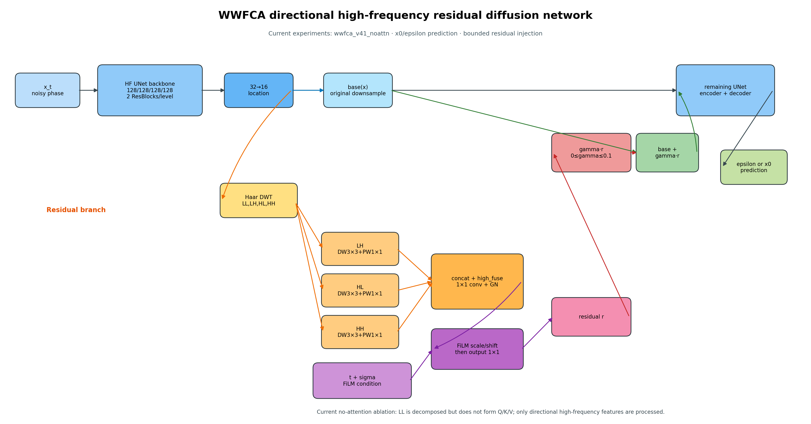

# 方向高频残差扩散网络结构

本文档对应当前 GFS128 实验中的 `directional_x0_t200`、`directional_epsilon_t200`，以及同类的 `wwfca_v41_noattn` 主干。它是在 Hugging Face `UNet2DModel` 中保留原始下采样路径，并在一个中间下采样位置加入方向高频残差。

## 总体数据流



```mermaid
flowchart LR
    A[带噪相位 x_t\n2通道输入] --> U[HF UNet 主干\n128/128/128/128\n每层2个ResNet block]
    T[扩散时间步 t] --> TE[时间嵌入]
    S[噪声尺度 sigma] --> C[concat(时间嵌入, log(1+sigma))]
    TE --> C
    U --> D[32→16 原始下采样]
    D --> O[后续UNet编码器/解码器]
    D -.替换为.-> R[基础下采样 base(x)]
    D -.同一输入特征 x.-> W[方向高频残差支路]
    W --> H[正交Haar DWT]
    H --> LL[LL 低频]
    H --> LH[LH 水平/方向高频]
    H --> HL[HL 垂直/方向高频]
    H --> HH[HH 对角高频]
    LH --> P1[深度可分离卷积\nGN+SiLU+DW3×3+PW1×1]
    HL --> P2[深度可分离卷积\nGN+SiLU+DW3×3+PW1×1]
    HH --> P3[深度可分离卷积\nGN+SiLU+DW3×3+PW1×1]
    P1 --> F[拼接 + 1×1 high_fuse\nGN]
    P2 --> F
    P3 --> F
    C --> FI[FiLM 条件调制\nscale/shift]
    F --> FI
    FI --> M[高频残差输出\n1×1 output conv]
    M --> G[有界注入 gamma·residual\ngamma≤0.1]
    R --> ADD[base + gamma·residual]
    G --> ADD
    ADD --> O
    O --> Y[预测噪声 epsilon\n或预测干净图像 x0]
```

## 模块说明

### 1. HF UNet 主干

- 使用 Hugging Face `UNet2DModel`，输入为带噪相位及条件通道，输出为单通道解缠相位目标。
- 四级通道宽度为 `128, 128, 128, 128`，每个下采样/上采样层包含2个残差块。
- 扩散时间步通过原始 UNet 时间嵌入进入主干。
- 方向残差只替换 `32→16` 位置的下采样器，其他主干参数和路径保持不变。

### 2. Haar 方向分解

对该位置的中间特征 `x` 做正交二维 Haar DWT：

\[
  (LL,LH,HL,HH)=\operatorname{DWT}(x).
\]

`LL` 是低频结构，`LH、HL、HH` 分别保留三个方向的高频变化。当前 `v41_noattn` 实验不把 `LL` 作为查询，也不计算 Q/K/V 注意力矩阵；三路高频直接进行方向独立卷积和融合。这正是“方向高频残差”消融的定义。

### 3. 高频残差支路

每个高频子带依次经过：

1. GroupNorm；
2. SiLU；
3. 深度卷积 `3×3`；
4. 点卷积 `1×1`。

处理后的 `LH、HL、HH` 在通道维拼接，再经过 `1×1 high_fuse` 压回原通道数，并使用 GroupNorm。时间条件通过 FiLM 产生逐通道 scale/shift：

\[
  h'=h\odot(1+\gamma_t)+\beta_t.
\]

最后经过 `1×1 output` 得到与基础下采样输出形状相同的残差 `r`。

### 4. 有界残差注入

原始下采样结果记为 `b=base(x)`，网络输出为：

\[
  y=b+\alpha r,
  \qquad \alpha=0.1\,\sigma(g),
\]

其中 `sigma` 是 Sigmoid，因此残差注入幅度被限制在 `0` 到 `0.1` 之间。这样可以保留HF基线的主路径，同时让方向高频只作为受控修正项参与后续UNet计算。

训练时还记录注入残差与基础分支的 RMS 比例，并对过大的注入施加能量约束；主训练目标仍保持原实验的单一 MSE，不额外改变loss定义。

## 两种预测目标

- `directional_x0_t200`：扩散训练步数200，网络预测归一化的干净相位 `x0`，固定5步采样。
- `directional_epsilon_t200`：扩散训练步数200，网络预测采样噪声 `epsilon`，固定25步采样。

两者使用相同的方向高频残差结构，差别只在扩散调度器的预测目标和推理步数。

## 与带注意力版本的关系

完整的 `wwfca_v41` 可以让 `LL` 生成查询、融合高频特征作为上下文，并通过空间注意力得到调制门控；当前 `directional_x0_t200` 与 `directional_epsilon_t200` 使用的是 `wwfca_v41_noattn`，即关闭 Q/K/V 和注意力矩阵，仅保留方向高频卷积、融合、FiLM 和有界残差注入，用于隔离高频残差本身的贡献。
