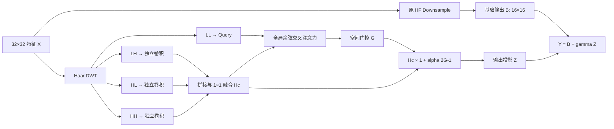

# WWFCA v4.1：LL 引导的空间高频门控残差

## 设计目标

v4.1 保留 v4 的核心约束：不划分窗口、不使用 IDWT、使用 LL 查询高频、在 HF U-Net 的 `32×32 → 16×16` 下采样位置并行注入残差。

v4 的主要问题是全局注意力接近均匀，高频 Value 在空间维被平均。v4.1 不再让注意力输出直接承担高频重建，而是让它生成调制门控；同位置高频特征拥有独立直达路径，因此不会因注意力均匀而消失。

## 高频路径

Haar DWT 得到：

`LL, LH, HL, HH = DWT(X)`。

三个方向分别使用独立的深度卷积和逐点卷积：

`H_i = PWConv_i(DWConv_i(SiLU(GN(H_i))))`，

其中 `i ∈ {LH, HL, HH}`。随后进行融合：

`H_c = Conv_1x1(Concat(H_LH, H_HL, H_HH))`。

这种结构允许水平、垂直和对角频率学习不同滤波器，避免 v4 在注意力之前就用同一个投影混合所有方向。

## 全局 LL 查询高频

Query 与 Key 使用余弦相似度：

`Q = Normalize(W_Q LN(LL))`，

`K = Normalize(W_K LN(H_c))`，

`V = W_V LN(H_c)`。

全局注意力为：

`A = Softmax(tau QK^T + B_rel - beta D)`。

- `tau` 是有界可学习温度，初始为 4，范围为 1 到 16；
- `B_rel` 是二维相对位置偏置；
- `D` 是归一化二维距离；
- `beta` 是有界距离强度，初始为 1，范围为 0 到 4。

所有 256 个 token 仍然可以相互注意，因此该模块仍是全局注意力。距离项只是初始化的位置先验，并未划分窗口或截断远距离连接。

## 注意力门控与空间直达路径

注意力结果只生成门控：

`G = sigmoid(W_G LN(A V))`。

随后调制保留空间位置的高频特征：

`H_m = H_c [1 + alpha (2G - 1)]`，

`Z = Conv_out(GN(H_m))`。

`alpha = 0.5 sigmoid(a)`，初始为 0.1。若注意力初期接近均匀，`H_c` 仍可完整传递；训练后，LL 查询结果可以按位置和通道增强或抑制高频。

最终残差注入为：

`Y = B + gamma Z`，

`gamma = 0.1 sigmoid(g)`，初始为 0.02。注入 RMS 超过基础输出的 1% 时施加能量惩罚。

## 噪声条件

HF timestep embedding 与 `log1p(sigma)` 拼接后，通过零初始化 FiLM 调制 `H_c`。这样同一个频率模块可以根据扩散时间步和输入噪声强度调整高频响应，初始时又不会破坏 HF 权重。

## 损失函数约束

v4.1 是纯结构消融，不修改 HF 的训练目标。启用版和关闭版都只使用原始干净归一化相位预测 MSE：

`L = MSE(x0_pred, x0_target)`。

残差能量比只作为诊断指标记录，不加入损失；不增加 DWT、梯度、SSIM 或其他辅助损失。这样 v4.1 与 off 的差异只能来自 WWFCA 结构。

## 严格验证协议

`wwfca_v41` 与 `wwfca_v41_off` 使用相同结构、参数量、HF epoch 299 初始权重、训练样本顺序、扩散噪声、验证种子和原始 HF 损失。

1. 前 15 轮冻结 HF 主干：分支学习率 `1e-4`；
2. 后 20 轮联合微调：分支学习率 `5e-5`，HF 主干学习率 `1e-6`；
3. 每轮保存权重；
4. 按验证集 U3 对齐 NRMSE 选择主最佳权重；
5. 记录注意力熵、门控空间标准差、温度、距离强度、gamma 和注入残差 RMS；
6. 最终比较 clean、0、5、10、20、30 dB 六个测试条件。

判定 v4.1 有效必须以同协议的 `wwfca_v41_off` 为对照。旧 HF 或 v4 结果只作为补充参考，不能替代该配对对照。

此前加入高频辅助损失的实验不属于有效的结构消融，已归档。新的正式结果必须来自本文件所述的不改损失协议。

不改损失的正式结果与归因分析见 `docs/WWFCA_V41_PURE_STRUCTURE_RESULT.zh-CN.md`。
