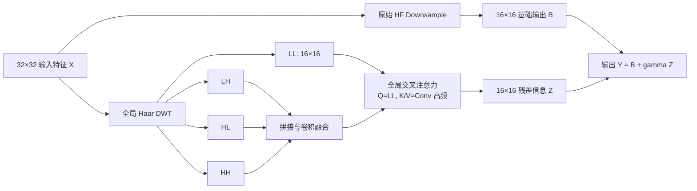

# WWFCA v4：全局小波频率交叉注意力残差下采样结构

## 设计目标

WWFCA v4 保留以下核心思想：对特征执行小波分解，以低频 LL 为 Query，以高频 LH、HL、HH 为 Key/Value，通过交叉注意力让低频结构选择有用的高频信息。

v4 不再划分窗口，也不执行 IDWT。模块放在 HF U-Net 最后一个编码器下采样位置，与原始 `32×32 -> 16×16` 下采样并行。注意力输出与原下采样输出都是 `16×16`，可以直接残差相加。

## 数学定义

设下采样前特征为

`X ∈ R^(B×C×H×W)`。

保留原 HF 路径：

`B = Downsample_HF(X)`。

并行执行正交 Haar DWT：

`LL, LH, HL, HH = DWT(X)`。

三个方向的高频先使用独立可学习通道权重，再拼接：

`H_cat = Concat(s_LH LH, s_HL HL, s_HH HH)`。

高频卷积融合采用：

`H_0 = Conv_1x1(H_cat)`，

`H_c = H_0 + eta Conv_1x1(DWConv_3x3(SiLU(GN(H_0))))`。

其中 `eta` 初始为 0.1，最大为 0.5。随后使用 timestep embedding 与 `log1p(sigma)` 生成零初始化 FiLM，对高频特征进行噪声条件调制。

交叉注意力为：

`Q = W_Q LN(LL)`，

`K = W_K LN(H_c)`，

`V = W_V LN(H_c)`，

`Z = W_O LN(Softmax(QK^T/sqrt(d) + B_rel)V)`。

`B_rel` 是二维相对位置偏置。v4 使用 4 个注意力头；在 `16×16` 子带上执行全局注意力，不使用局部窗口。

最终输出：

`Y = B + gamma Z`，

其中

`gamma = 0.1 sigmoid(a)`，

初始 `gamma=0.02`，最大为 0.1。输出投影使用增益为 0.1 的缩放 Xavier 非零初始化，因此 Q/K/V 和高频卷积从第一步即可获得有效梯度。初始化检查要求注入残差与主分支的 RMS 比值处于 `1e-4` 到 `1e-3` 数量级：足以传播梯度，又远低于 1% 的能量约束阈值。

## 与旧版本的区别

| 版本 | 频率交互 | 输出融合 | 主要问题或改进 |
|---|---|---|---|
| 原 WWFCA | 窗口内 `LL <- H` | nearest 放大后残差 | 窗口边界、块状恢复 |
| v2 | `H <- LL` | 高频 IDWT 残差 | 偏离原始方向，门控过强 |
| v3 | `H <- LL` | 有界高频 IDWT 残差 | 零门控导致支路无梯度 |
| v4 | 全局 `LL <- Conv(H)` | 直接注入原 HF 下采样输出 | 保留原始方向，无需窗口和 IDWT |

## 插入位置与计算量

模块只放在倒数第二个 down block 的下采样器中：输入 32×32，输出 16×16。DWT 后 Query 和 Key/Value 都有 256 个 token。注意力矩阵为 `256×256`，计算量可控。

原始 HF downsample 完整保留。`wwfca_v4_off` 可以加载 HF 权重并逐元素复现原始输出；`wwfca_v4` 只增加并行频率残差。

## 训练建议

主干从 HF epoch 299 初始化，而不是重新从头训练：

1. 前 5 轮冻结 HF，WWFCA 学习率 `1e-4`。
2. 后 20 轮联合微调，HF 学习率 `1e-5`，WWFCA 学习率 `5e-5`。
3. weight decay 为 `1e-4`，dropout 为 0.05，梯度裁剪为 1.0。
4. control 与 v4 使用相同 HF 初始权重、数据顺序、扩散噪声和固定验证种子。
5. 只有实际注入残差 RMS 超过原下采样输出 1% 时才施加能量惩罚。

建议记录 `gamma`、注入残差 RMS 比、归一化注意力熵、三个频带权重、主干/WWFCA 梯度范数及各 SNR 的完整指标。
